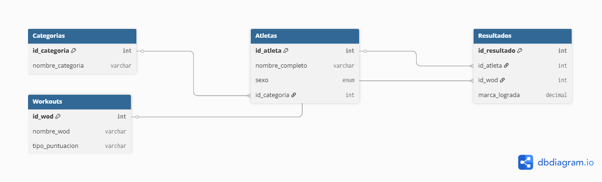

# 🏋️‍♂️ Sistema de Gestión de Competencias: "LA ROCA" 2026



## 📋 Descripción del Proyecto
Este proyecto consiste en el diseño y desarrollo de una base de datos relacional para la gestión de atletas y categorías en competencias de Crossfit de alto rendimiento. 

La idea nació de mi experiencia personal como atleta, tras clasificar con mi equipo para la competencia **"LA ROCA "** en la categoría **Avanzado**. Decidí aplicar mis conocimientos del último año de la carrera de **Analista de Sistemas** para modelar una solución técnica que resuelva la organización de un evento real.

## 🛠️ Tecnologías Utilizadas
* **Lenguaje:** SQL (MySQL)
* **Entorno:** Visual Studio Code / MySQL Workbench
* **Conceptos Aplicados:** Normalización de datos, Integridad referencial (Foreign Keys), Consultas Complejas (JOINs).

## 🚀 Estructura del Modelo
El sistema permite:
1.  **Segmentación por Niveles:** Manejo de categorías (Avanzado, RX, Scaled) para asegurar la competencia justa.
2.  **Registro de Atletas:** Base de datos centralizada con validación de datos.
3.  **Escalabilidad:** Diseñado para permitir la carga masiva de resultados y generación de Leaderboards en tiempo real.

## 📈 Ejemplo de Consulta Profesional
El script incluye una consulta avanzada que vincula las tablas de atletas con sus categorías para generar reportes limpios:

```sql
SELECT a.nombre_completo, c.nombre_categoria 
FROM Atletas a
JOIN Categorias c ON a.id_categoria = c.id_categoria;
Contacto: Gaston Maristany - Estudiante de Sistemas @ UTN
